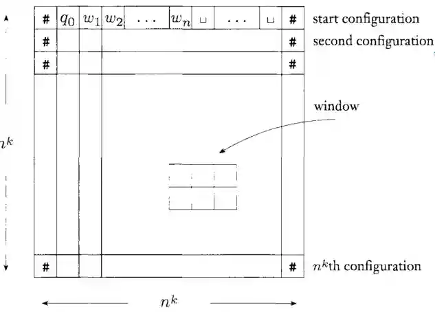

Cook Levin theorem is important because says that in 1971 if $SAT \in P$ then $NP = P$. We will start with this idea to define the concept of **NP-completeness**. Let's start with the basics.

###  Poly-reduction

#### Def: poly-reduction🟩

We say that two languages $L$ and $L'$ defines over alphabet $\Sigma$. We say that $L´$ is poly (mapping)-reducible in $L$, $L' \leq_{p} L$ when a $TM$ that computes *polynomial time* a function $f: \Sigma^{*} \to \Sigma^{*}$  such that
$$
x \in L' \iff f(x) \in L
$$
This is very similar to the [Halting Theorem and Reducibility#Mapping reducibility](./halting-theorem-and-reducibility#mapping-reducibility).
The difference is that it needs to be *polynomially-bounded*, so to say, it is efficient function.

#### Th: $L' \leq_{p} L \land L \in P \implies L' \in P$🟩
This theorem says that if we can reduce with a polynomially bounded function to a class of language in $P$ then we have automatically another language in $P$.

**Proof:**
If $L \in P$ there exists a  $g$ that decides it in poly-time. If $L' \leq _p L$ then exists $TM$ that polynomially computes a language into $L$, calculating $f$. Then we build this machine:

Given $x \in L'$ in input, we say $g(f(x))$ decides that language. And we know that composition of polynomial functions is polynomial. So that function is polynomial and we proved it.

#### Th: $L \in P \implies L^{-} \leq_{p} L$🟩

Given a $\omega$ let's run the decider to know whether if $\omega \in L$. If we know this then we know if $\omega \in L'$ or not just by inverting the last result.
Now let's build the converter, which works in constant time. Take two words $\omega_{1}, \omega_{2}$ such that $\omega_{1} \in L \land \omega_{2} \not \in L$ then if $\omega \in L' \implies f(\omega) = \omega_{1}$ and if $\omega \not \in L' \implies f(\omega) = \omega_{2}$ this ends the proof.
$f$ works in polynomial time thanks to the fact that $L \in P$.

## Cook-Levin Theorem

### Def: NP-completeness🟩
We say that a $L$ is NP-complete if it is in $NP$ and every other $L'$ is reducible in $NP$ using [#Poly-reduction](#poly-reduction).

### Def: NP-hard🟩
$L$ is NP-hard if every $L'$ in $NP$ in reducible to it using [#Poly-reduction](#poly-reduction). We don't need that it is in $NP$.

### TMSAT🟨

This is a **universal verifier**.
$$
TMSAT = \left\{  \langle x, w, s,t \rangle  \mid x = code(M) \text{ and } M \text{ accepts } \langle w, c \rangle  \right\} 
$$
With other constraints of the length of the input and the time of the computation.

As this is a verifier we can prove that this language is $NP-complete$ but it is useless, because it says nothing on the class of problems.

### Problem statement🟩
We want to prove that $SAT \in NP-complete$ This is what Cook-Levin states.

this would imply that every other problem in $NP$ can be reduced into SAT, for example clique which is in NP, so we prove that $P = NP$

### Proof of Cook-Levin

#### SAT is in NP🟩
This is quite easy, just non-deterministically take an assignment. If any of these assignments accept, then accept.
We can say that SAT is easily verifiable.

#### SAT is NP-hard🟨-

This is the difficult part.
The idea is to create a representation of the computation of the Turing Machine of whatever algorithm. So we create a **tableau** that represents the computation, and we want to translate this tableau as a satisfiability problem. We know that this tableau is finite because the problem is in $NP$.

We say that a formula is
$$
F_{w} := F_{cell} \land F_{start} \land F_{move} \land F_{accept}
$$
And we want to say that this is satisfiable $\iff$ exists a tableau as defined above such that accepts $\iff$ a computation on $w$ of the machine $M$ accepts it.

Let's define
$$
\left\{ x _{i, j, s} \mid (i, j) \in n^{k} \times n^{k} ,s \in Q \cup \Sigma \cup \left\{ \# \right\}  \right\} 
$$
For example the variable $x_{1, 2, q_{0}}$ should be true.
$$
F_{start} = x_{1, 1, \#} \land x_{1, 2, q_{0}} \land \\
x_{1,3, w_{1}} \land x_{1, 4, w_{2}} \land \dots \land x_{1, n + 2, w_{n}} \land \\
x_{1, n + 3, \textvisiblespace} \land \dots \land x_{1, n^{k} - 1, \textvisiblespace x_{1, n^{k}, \#}}
$$
It means that the initial configuration is that of the Turing machine.

Then 
$$
F_{cell} = \bigwedge_{1 \leq i, j \leq n ^{k}} \left[ (\bigvee_{s \in C} x_{i, j , s}) \land (\bigwedge_{s, t \in C, s\neq t} (\bar{x}_{i, j, s} \lor \bar{x}_{i,j,t})) \right] 
$$

In natural language:
Exists at least a $s$ that is true, and other are false, for every cell in the tableau. That means that for every single cell, we have something like $x_{1, 2, a}$ which is true.

$$
F_{accept} = \bigvee_{1 \leq i, j \leq n^{k}} x_{i,j, T}
$$

Then we need to define the $F_{move}$ function, which is the last formula we would need to define!
As we only need to know how the state moves, we just need **windows** of 3.

Examples:

So for example:
$$
F_{move} = \bigwedge_{1 <i\leq n^{k}, 1 < j \leq n^{k}} \left( \bigvee_{a_{1},\dots, a_{6}} x_{i,j-1,a_{1}} \land x_{i,j, a_{2}} \land x_{i, j + 1, a_{3}} \land x_{i+1, j-1, a_{4}} \land x_{i+1, j , a_{5}} \land x_{i+1, j+ 1, a_{6}}\right) 
$$
Where $a_{1}, \dots, a_{6}$ are symbols of admissible windows.
The initial and says that that should hold for every cell. (this is also the reason why we pad with $\#$ at the beginning, because the $(i, j)$ windows is the $2\times{3}$  block such that the center is in the upper center of the rectangle.

This with the idea that Tableau is buildable in poly-bounded time, should finish the proof.

We see with this construction that
$F_{cell} \approx O(n^{2k})$, $F_{start} \approx O(n^{k})$ , and the others $n^{2k}$ as they cycle for every cell in the tableau. So this construction is valid and takes poly time.

## Savitch Theorem

### Savitch's statement🟩
Given any function $f : \mathbb{N} \to \mathbb{R}^{+}$ where $f(n) \geq n$ (prolly later you can get a tighter bound, like $f(n) \geq \log n$).
Then we have that
$$
NSPACE(f(N)) \subseteq SPACE(f^{2}(n))
$$

Which is a surprising statement about non-deterministic space complexity, because it implies that
$$
NSPACE = PSPACE
$$

### Sketch of the proof idea🟩
The proof idea uses a similar idea explored in [Common problems in Theoretical CS#True quantified Boolean formula](./common-problems-in-theoretical-cs#true-quantified-boolean-formula), saying that TQBF was PSPACE-complete.

So given two configurations of the NTM, $c_{1}, c_{2}$ we want to say that it's possible to reach from $c_{1}$ to $c_{2}$ in at most $t$ computational steps in the new deterministic TM that we are going to build.
We already know by hypothesis that the given NTM is in $NSPACE(t(n))$ now we will prove that the built TM is in $SPACE(t(n^{2}))$, so by this reduction we know that we have that inclusion.

For the inductive case, We want to build a function `REACH` that is true if and only if the TM starting from state $c$ can reach $c'$ in at most $t$ computational steps.
Then we can define a TM in this way.
Run `REACH`$c_{init}, c_{acc}, 2^{dt(n)}$ if this accepts, accepts. We have chosen that exponential value because at maximum you can modify those number of states with $n$ of input length.

### Proof of Savitch's theorem🟩-
We prove it by induction:
If $t=1$ verify if $c_{1} = c_{2}$ or if $c_{2}$ is a reachable configuration with $1$ computational step. You can do this by enumerating all possible transition functions starting with that state for example. If ok accept, else reject.
The logic for enumerating possible transitions is presented in the proof of [#Cook-Levin Theorem](#cook-levin-theorem).

Else we run for each $c_{m}$ configuration of the TM, that is bounded and uses $t(n)$ space.
1. `REACH(c, c_m, t/2)`
2. `REACH(c_m, c', t/2)`
3. If both ends accept, then accept.

Let's analyze this algorithm. $dt(n)$ is the depth of the recursion tree. The algorithm is probably exponential in time, but we are only concerned by the width space.
Every recursive step uses only takes $O(n)$ space, and in total we have $O(n)$ in depth, so we can solve this in $O(n^{2})$ space.
