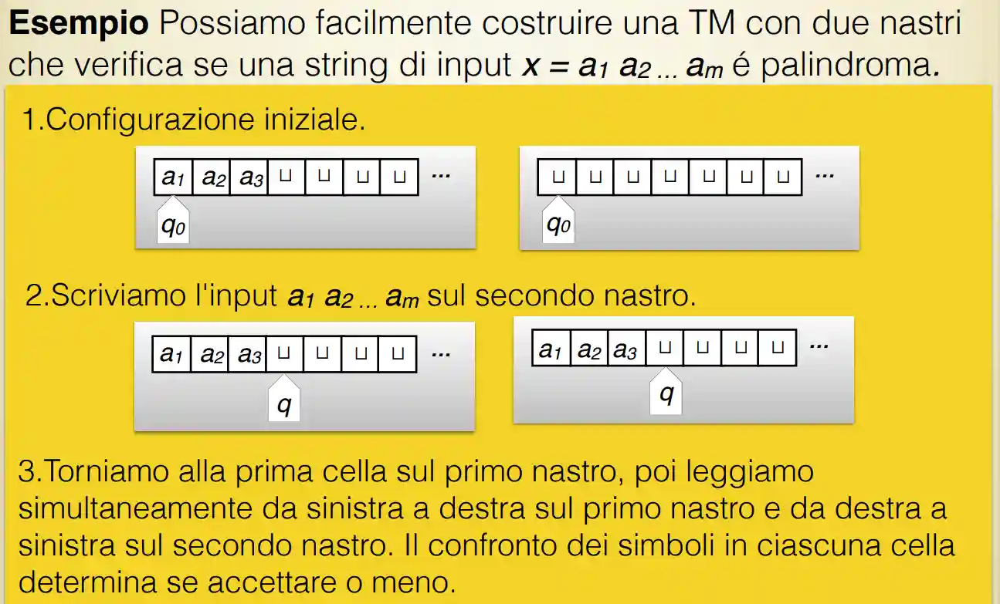
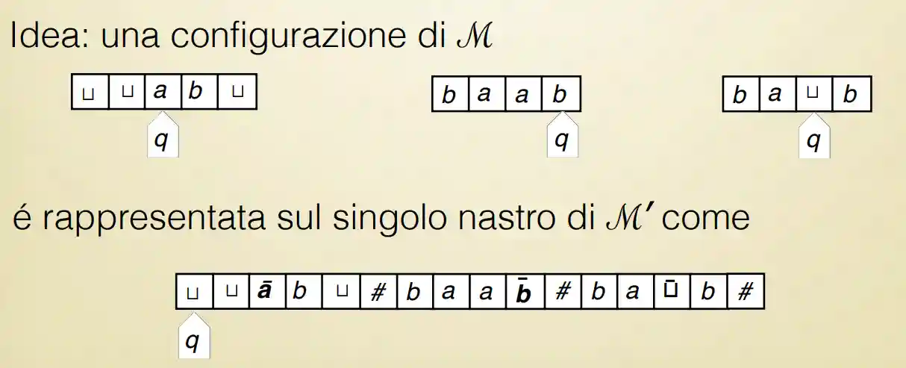
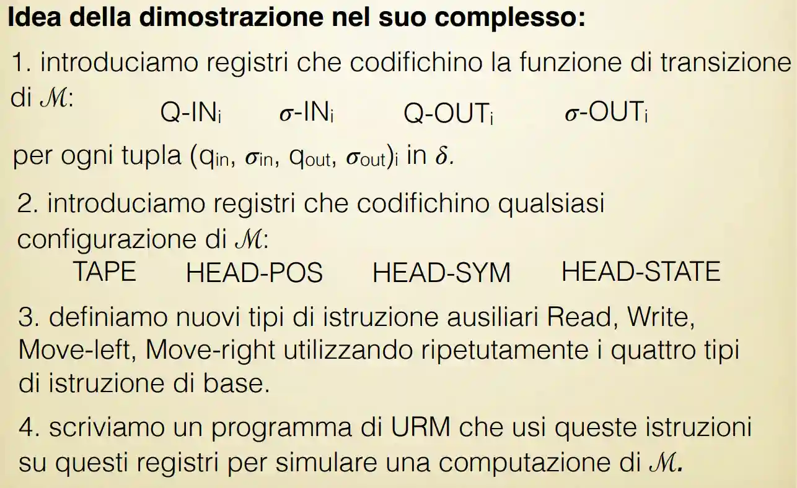

Sono variazioni possibili equivalenti:
• Nastri addizionali • Testine addizionali • Nastri infiniti su entrambi i lati • Non-determinismo • Scelta probabilistica • Scelta quantistica
Si può dire che la definizione di TM è stata **robusta** nella storia perché tantissimi formalismi che intuitivamente sembrano essere molto diversi rispetto alla TM alla fine possono essere dimostrate essere equivalenti.

### Turing con nastri addizionali
Questo è presente in modo abbastanza facile sul Sipser.

> La computazione comincia con l’input sul primo nastro, e tutti gli altri nastri vuoti. Macchine di Turing con nastri addizionali In ciascun passo di computazione, ogni testina é nello stesso stato, ma può essere in una posizione diversa, leggere un simbolo differente, e compiere un’azione diversa. Se si raggiunge uno stato finale, l’output é letto dal primo nastro.

#### Definizione formalismo 🟩
L'unica differenza formale è che questa macchina è **parallela** cioè ho molte macchine di turing che vanno allo stesso momento
$$
\delta: (Q - H) \times \Sigma^{k} \to Q \times(\Sigma \times \left\{ \to, \leftarrow \right\} )^{k}
$$
Il restante delle tuple resta uguale. L'altra osservazione è che lo stato esterno è **unico**.
In un certo senso è una **pila con macchina di turing** Linguaggi liberi e PDA.

#### Teorema di equivalenza 🟩
Dimostriamo che questo formalismo è equivalente con [La macchina di Turing](./la-macchina-di-turing).
È ovvio il caso in cui *nastro addizionale* -> *Turing*.
Ossia che
1. Termina quando il l'altro non termina
2. Se termina hanno stesso output.

Si può formalizzare però alla fine è quello.

L'altra freccia è provare a simulare con [La macchina di Turing](./la-macchina-di-turing) tutti i nastri aggiuntivi del nostro multinastro, con un simbolo in più che identifichiamo con $\#$.
Cominciamo (dimostrazione intuitiva):
Supponiamo di avere una macchina multi nastro $\mathcal{M}$, costruiamo con l'altra macchina $\mathcal{M}'$ con singolo nastro che sia equivalente al primo, in questo modo dimostriamo che una TM è anche uguale alla versione multi-nastro.
Prendiamo
$$
\Sigma' =  \Sigma \cup \left\{ \# \right\}  \cup \left\{ \bar{a} : a \in \Sigma \right\} 
$$
Allora

I molteplici passi di computazione su molti nastri che sono un singolo passo per la multinastro possono essere simulati sul singolo nastro.
La lettere barretta ci permette di mantenere il pointer sul nastro originale. Se c'è bisogno di spazio in più su un nastro, debbo postare tutto a destra (tanto è infinito e posso farlo). (nota che per questo teorema è necessario l'infinito!!)
Alla fine cancello tutto dopo il primo cancelletto e ritorno quello.
#### Enumerators 
Questo è un argomento extra non trattato a lezione 3.2 del Sipser viene trattato.
Si può dire che è una altra cosa equivalente alla [La macchina di Turing](./la-macchina-di-turing).
In modo informale, un enumeratore è una macchina di turing con una stampante, che può esser considerato l'output della nostra macchina.
Poi c'è un work tape che può essere utilizzato come cache.
Da un punto di vista formale non è altro che una macchina di turing con 2 nastri

### Macchine di Turing non deterministiche
#### Descrizione formalismo non deterministico 🟩
L'unica differenza con [La macchina di Turing](./la-macchina-di-turing), è che invece di funzione abbiamo una **relazione**! Ossia da un unico stato e simbolo sul nastro possono avere molti simboli e stati di arrivo.
$$
\delta: ((Q - H) \times \Sigma) \times (Q \times\Sigma \times \left\{ \to, \leftarrow \right\} )
$$
Oltre a questo anche lo stato di accettazione, se un qualunque ramo accetta, allora questa macchina accetta.
Può anche essere rappresentato da una funzione sull'insieme delle parti, anche se potrebbe sembrare meno intuitivo.
$$
\delta: ((Q - H) \times \Sigma) \to \mathbb{P}(Q \times\Sigma \times \left\{ \to, \leftarrow \right\} )
$$

In un certo senso questo non determinismo è simile a quanto fatto in Grammatiche Regolari e Linguaggi liberi e PDA. Per il non determinismo. Solo che lì il prof. li faceva più formali.

Sulle slides c'è un esempio di NMT molto semplice per dimostrare che la primalità di un numero è calcolabile. (idea prendo in modo non deterministico un numero minore di $n$ e calcolo il modulo).

#### Sketch di dimostrazione di equivalenza 🟨++
Supponendo che abbiamo l'albero di computazione, posso esplorare con [Grafi#BFS](./grafi#bfs) tutto l'albero di computazione e avere alla fine lo stesso risultato.

Qui c'è un albero di computazione. (poi probabilmente bisognerà codificare un backtracking)

### Altre
Una altra macchina di Turing di interesse che non trattiamo qui è il prefix turing machine, che trattiamo in Kolmogorov complexity.

### Macchine a registri
Chiamato anche **URM** *unlimited register machine*, è un formalismo più simile a come sono fatti i computer moderni perché utilizzano i regsitri. 
Definito in [(Shepherdson & Sturgis 1963)](https://dl.acm.org/doi/10.1145/321160.321170).
#### Descrizione Unlimited Register Machine🟨++
Supponiamo di avere $R_{1}, R_{2}, R_{3}, \dots$ registri, ogni registro ha un numero naturale indicato con $r_{n}$ (contenuto di registro $n$)
Se la computazione finisce, questa viene messa in $R_{1}$ (simile a RAX in archietture intel).
L'input $N^{k}$ è messo in tutti i registri in ordine (se non definito sono a 0).

Esistono un sistema di istruzioni che muovono e modificano le cose dei registri:
1. **Zero** $Z(n)$ il registro $n$ è messo a 0.
2. **Successor** $S(n)$ il registro $n$ è aumentato a $n$
3. **Move** $R(n, m)$ $m$ è messo uguale a $n$ (sono registri)
4. **Jump** $J(n, m, p)$ Salta a istruzione $I_{p}$ se i registri $n$ e $m$ sono uguali. altrimenti ignora istruzione.

Ora possiamo definire una specie di [ALU](./cpu-e-storia-degli-elaboratori#3.1.2-alu) che è la cosa classica di programma imperativo.

#### Enunciato equivalenza 🟩
Vogliamo passare in questo caso a dimostrare la calcolabilità di funzioni parziali, ossia funzioni 
$$
\mathbb{N}^{k} \to \mathbb{N}
$$
Che possono anche non terminare (in questo caso parziale).
> Una funzione parziale è calcolabile in URM sse è calcolabile su TM

#### Idea TM => URM 🟨
Uso il risultato in [#Turing con nastri addizionali](#turing-con-nastri-addizionali), ho tanti nastri che fanno cose:
1. Fa *instruction pointer* e punta all'istruzione attuale
2. Ha il codice del programma
3. Ha il valore dei registri in notazione unaria (che è equivalente), separati da U.
4. Altri registri sono cache.

Allora posso usare il contenuto del nastro 1 per trovare l'istruzione, poi uso altro per interpretarla ed eseguirla. Alla fine uso il primo valore del terzo nastro per avere il risultato.
Per la modifica dei registri posso usare nastri ausiliari.

#### Idea TM <= URM 🟨
Supponiamo di avere un URM, vogliamo simulare una macchina di turing con la classica tupla $\Sigma, Q, q_{0}, H, \delta$  
Chiamo un registro *TAPE* che conterrà i valori presenti su un nastro di Turing.
Inoltre dobbiamo ricordarci che questa macchina contiene **numeri naturali** per questo motivo abbiamo bisogno di una codifica.
Scegliamo $\Sigma = \left\{ 0, 1, U \right\}$ dove $U$ sta per empty, nel caso in cui l'alfabeto sia diverso da questo, la dimostrazione dovrà essere equivalente.
Allora possiamo usare la notazione in base $3$ per decodificare il numero, assumendo $code(0) = 0$, $code(1) = 1$, $code(U) = 2$.

Poi introduciamo registri per codificare $\delta$ la funzione di transizione.

### Modello WHILE
Questo è un formalismo più simile a uno di alto livello (quindi programma normale).Descritto in 
> Kfoury, Moll, Arbib - A programming approach to computability.

#### Descrizione del modello WHILE(3)🟩
Questo è simile a quanto descritto per la Semantica di un linguaggio per la parte procedurale.
Abbiamo:
1. Assegnazione
2. Cicli while
3. seguenziamento

Possiamo definirlo in [Sintassi e RI strutturali#4.2 Backus-Naur Form](./sintassi-e-ri-strutturali#4.2-backus-naur-form)

Ci sono tre forme di assegnazione, uno zero, uno successivo, uno uguale credo.
Non viene fatta la parte della semantica che abbiamo fatto tempo fa a linguaggi.
#### Dimostrazione equivalenza 🟩
> Una funzione (parziale) é computabile da un programma WHILE se e solo se é computabile da una macchina di Turing.

Si dimostra per [induzione strutturale](./sintassi-e-ri-strutturali#4.7-induzione-strutturale) sulla BNF lì precedente.
I casi base sono i 3 assegnamenti (zero, successore, e predecessore) e il programma vuoto.

Per il caso base, utilizzo un nastro separato come ho fatto per [#Turing con nastri addizionali](#turing-con-nastri-addizionali), su questo ci metto le variabili di interesse.
Su questo posso codificare i casi base accennati di sopra.

Poi caso induttivo è while e sequenza di istruzioni.
Poi per codificare la sequenza, basta concatenare molte macchine di turing normali, ognuna che codifica l'istruzione. Sappiamo che queste esistono per ipotesi induttiva.

Per il while possiamo usare due macchine, una per il test, una per il corpo del while e dire che accetta quando esco dal ciclo.

È interessante osservare come siano uguali questi.

# References

[1] Shepherdson & Sturgis [“Computability of Recursive Functions”](https://dl.acm.org/doi/10.1145/321160.321170) Journal of the ACM Vol. 10(2), pp. 217--255 1963
