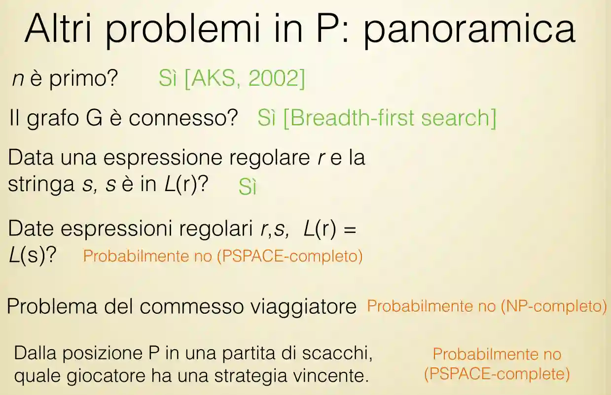
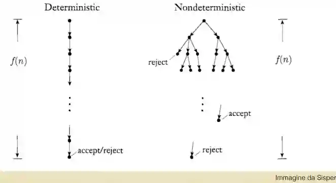

In this note we explore a theme of time and space complexity. Those are cardinal themes in Theoretical CS. 
Time -> execution step bounds on algorithms
Space -> the cells visited by a [Turing Machine](./la-macchina-di-turing) when executed.

## Introduction to Time Complexity
This note will build upon know techniques of algorithms analysis explained in Notazione Asintotica.
We will need big-$O$ notation and $o$ notation.
L'idea è che il problema di decisione è decidibile se limito la lunghezza del teorema.
Simile al [numero di Chaitin](https://en.wikipedia.org/wiki/Chaitin%27s_constant), che non è computabile, ma è approssimabile quanto si vuole. In un certo senso è computabile.
The general idea is to ask how the function $\varphi$ that maps the longest $n$ proof to the number of steps of computation behaves.
### Robustness of the notion of time complexity🟨

The notion of "computational steps" used to measure the time complexity varies along
- Computational models
- definition of computational steps
- The code of the input and output (not always binary, for example big numbers are not fixed size).

### Influence of the Computational Model
In Complexity Theory **the choice of the formal model** influences the complexity class of the model!
This is different from the argument from computational theory of the [Church Turing Thesis](./la-macchina-di-turing#tesi-di-church-turing), where it asserts that a function is computable in every computational model. See 7.7 in [(Sipser 2012)](https://books.google.it/books/about/Introduction_to_the_Theory_of_Computatio.html?id=P3f6CAAAQBAJ).

#### Multi-tape vs single-tape TM
It can be proved that every $t(n)$ time multi-tape TM can be simulated by a $t^{2}(n)$ single tape TM. See Theorem 7.8 of [(Sipser 2012)](https://books.google.it/books/about/Introduction_to_the_Theory_of_Computatio.html?id=P3f6CAAAQBAJ).

## The Time Complexity Class
### Definition of the Time Complexity Class🟩

> Languages that are decidable in $O(t(n))$ time are part of this class, denoted as $TIME(t(n))$.  With $t : \mathbb{N} \to \mathbb{R}^{+}$. 

Another way to understand this is that if a algorithms **terminates** in at most $t(n)$ steps then it belongs to this class.

### Polynomial Complexity Class🟩

The polynomial class $P$ is defined as:
$$
P = \bigcup_{i \geq 1} TIME(n^{i})
$$
This is defined as the class of the **reasonable** efficiency programs.
NOTE: this is invariant with respect to the chosen coding system (if an algorithm is still in P, then it will remain in P even if you change code scheme).

1. P is invariant for all models of computation that are polynomially equivalent to the deterministic single-tape Turing machine, and
2. P roughly corresponds to the class of problems that are realistically solvable on a computer.

Analogously we define
$$
EXP = \bigcup_{i \geq 1} TIME(2^{n^{i}})
$$
See later.

#### PATH is in P🟩
We can prove that the language
$\left\{ \langle G, s, t \rangle \mid G \text{ is a graph that has a route from } s \text{ to } t \right\}$
is in $P$ class. (Just use [Grafi#BFS](./grafi#bfs) or [Grafi#DFS](./grafi#dfs)).

NOTE: we have worked assuming that the algorithm worked on the nodes, but usually TM work with bits, the thing is that there is a polynomial algo that converts that nodes into binary format, so it is not much of a big deal.

#### Overview of problems in $P$ 

### Exponential Complexity Class🟩
The exponential class $EXP$ is defined as:
$$
EXP = \bigcup_{i\geq 1} TIME(2^{n^{i}})
$$
This class is common of the algorithms that use backtracking, for example CSP problems. Or just brute-force search all the branches.

### Non-deterministic Complexity Class
Let $N$ be a non-deterministic decider (which means that the TM will halt on every computation branch) then we have that a problem is in this complexity class, called $NTIME$ if the running time cost $f: \mathbb{N} \to \mathbb{N}$ is bounded by that (longest computational branch).
The difference with [#Polynomial Complexity Class](#polynomial-complexity-class) is that here we consider the length of a single branch, but we explore everything at the same time!

Quindi

$$
NP = \bigcup_{i\geq 1} NTIME(n^{k})
$$

#### Simulation by Deterministic TM
We can prove that every TM in NP can be simulated by a deterministic machine in $2^{Ot(n)}$ time, where $t(n)$ is the complexity class of the TM. The intuition is easy, just try *every possible computational branch*, and see for the result.
We then observe that $NP \subseteq EXP$ but this is not so useful.
#### Clique problem
See [Common problems in Theoretical CS#The Clique problem](./common-problems-in-theoretical-cs#the-clique-problem) for description of the problem.

**NP algorithm**
Just
1. Select a subset of nodes from $G$. Do it non deterministically.
2. Verify if this subset is a complete graph. If yes add it to the solution set.

We can prove that this is correct, and it works, but it is a non deterministic algorithm, so it isn't easily simulated by deterministic algorithms, even though we proved in [Estensioni di Turing e altre macchine](./estensioni-di-turing-e-altre-macchine) that from the computability point of view it is the same.

**Verifiable**
Given input the graph, and a subset, we need to
1. For each node in the subset, check if it is linked to each other.
2. Return the previous truth result.
So easy.

#### Other NP-complete problems
If you have some time, you should give a proof for each problem (poly-reduction from sat)
- Vertex Cover
- Hamiltonian paths
- Undirected Hamiltonian paths
- Subset-sum

### Verifiability
#### Def: verifiability

Definition:
$A$ is verifiable if exists a TM $M$ such that:
$$
w \in A \iff \exists c : M \text{ accepts } \langle w, c \rangle 
$$
If $M$ is polynomial then we say that this is **polynomially verifiable**. We can prove that this notion is equivalent for $NP$ complexity classes.
We also require that $c$ is of *polynomial length*.
#### Th: Verifiability = NP🟩
From a philosophical point of view, if a problem is in NP, we can just guess a solution, or just do brute force. There is no classical algorithmical solution that solves it, or a constructive proof for it.

$\leftarrow$: let's suppose we have a $M$ that decides non deterministically that language.
On input $\langle w, c \rangle$ we run $M(w)$ and if it accepts, return true if the branch is good. ($c$ guides us about what non-deterministic branch to choose).

$\to$ : let's assume we have a polynomial verifier, we need to build a TM that decides it non deterministically in polynomial time.
choose non deterministically a certificate $c$ the encodes the path of the non-deterministic computation. If this accepts then accept!

#### Philosophical thoughts on P vs NP
Intuitively we can have this intuition:
The class of problems in $P$ is the class of problems were you need to come up with a solution by yourself.
The class of problems in $NP$ is the class of problems were you just need to **verify** if a given solution is valid.
From a personal human point of view this clearly seem to indicate that the two classes are *different*. But we have no proof.

> If P were equal to NP, then the world would be a profoundly different place than we usually assume it to be. There would be no special value in “creative leaps”, no fundamental gap between solving a problem and recognizing the solution once it’s found. Everyone who could appreciate a symphony would be Mozart; Everyone who could follow a step-by-step argument would be Gauss. 
> 
> *– Prof. Scott Aaronson, 2006*

## Space complexity terminology
### Def: space complexity

Given a $\mathcal{M}$ Turing Machine that halts on every input, then his space complexity is a function $t : \mathbb{N} \to \mathbb{N}$ such that $t(n)$ is the **maximum** number of cells visited by $\mathcal{M}$ on inputs of length $n$.
We can say something very similar for the *non-deterministic TM*, se way that its space complexity is the **maximum** number of tape cells visited on a single computational branch.

### Def: Space complexity Class
We define the **space complexity class** $SPACE(t(n))$ as all languages decidable by a TM in $O(t(n))$ space.
Analogously the $NSPACE(t(n))$ complexity class is defined. We use a non-deterministic TM here.

We willl ater find that
$$
P \subseteq NP \subseteq PSPACE = NPSPACE \subseteq  EXPTIME
$$
The last subset is given by an observation that a TM that uses $f(n)$ space (PSPACE) cannot have more than $f(n)2^{O(f(n))}$ computational steps before looping.

### Def: PSPACE and NPSPACE

We define in a matter similar to what is done in [Time and Space Complexity](./time-and-space-complexity):
$$
PSPACE = \bigcup_{k}SPACE(n^{k})
$$
And
$$
NPSPACE = \bigcup_{k} NSPACE(n^{k})
$$
### Def: PSPACE-completeness
We say that $L$ is PSPACE-complete if it is $\in PSPACE$ and every other $L' \in PSPACE$ is [poly-reducible](./cook-levin-and-savitch#poly-reduction) to it.

## Th: $NP \in PSPACE$
In order to prove this we prove that $SAT \in PSPACE$ because as it is $NP-complete$ every NP problem can be reduced to $SAT$ and so it is in $PSPACE$. 
For more about SAT see [Common problems in Theoretical CS#The SAT problem](./common-problems-in-theoretical-cs#the-sat-problem).

#### Proof of SAT in PSPACE
We note that the simple algorithm that just enumerates all possible assignments is in $PSPACE$.
Consider this algorithm:
For all assignments for the input boolean formula do:
1. Assign it and verify in poly-time if it is ok.
2. If ok return true else continue until every assignment is used.
We note that just $O(m)$ space is used, where $m$ is the number of terms. All the computation could be done in polynomial space, so the problem is in PSPACE. $\square$.

# References

[1] Sipser [“Introduction to the Theory of Computation”](https://books.google.it/books/about/Introduction_to_the_Theory_of_Computatio.html?id=P3f6CAAAQBAJ) Cengage Learning 2012
