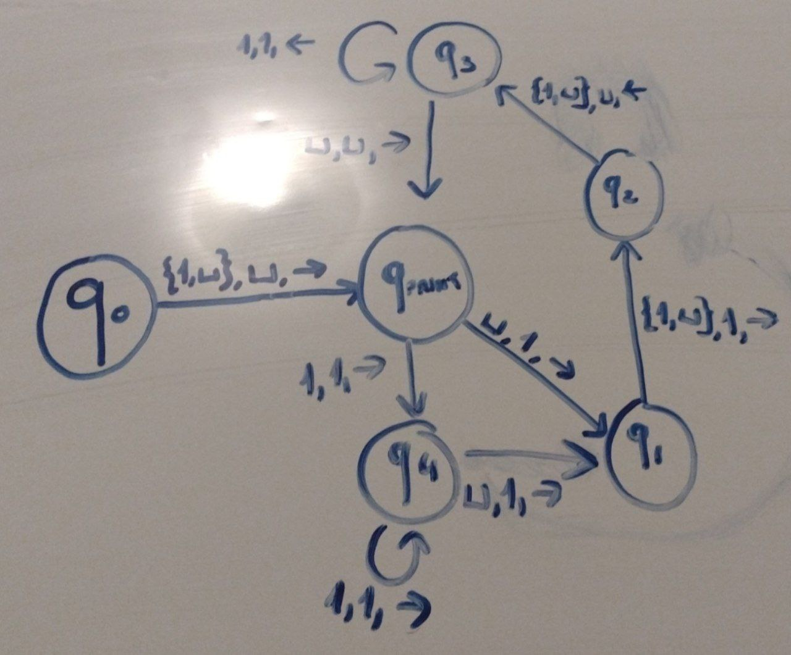

# Soluzione degli esercizi difficili dell'esercitazione 1

Professore e tutor non hanno rilasciato soluzioni ufficiali. Queste sono state
proposte dagli studenti.

## Problema 5

### 5.a

In un dato istante, un modello di computazione della classe C ha accesso solo
alle seguenti informazioni:

1. la porzione di dati in ingresso ancora non letta;
2. il simbolo sulla cella attuale, che appartiene a un alfabeto finito;
3. lo stato attuale, che appartiene a un alfabeto finito.

La porzione di nastro già oltepassata non è più accessibile, e quindi non
costituisce memoria ausiliaria. Solo (2) e (3) costituiscono la memoria
ausiliaria della macchina, che quindi è limitata superiormente, proprio come nel
caso di una DFA/NFA. Una MT, invece, ha a disposizione memoria ausiliaria
infinita.

### 5.b

Sia $M = (\Sigma, Q, q_0, H, \delta)$ una macchina di classe C. Considero l'NFA
$N = (\Sigma, Q \times \Sigma, (q_0, \textvisiblespace), H \times \Sigma, \delta')$,
where:

$$\forall x \in \Sigma \quad \delta'((q_0, \textvisiblespace), x) = (q_0, x)$$

$$\forall q \in Q \quad \forall x,y \in \Sigma \quad \delta'((q, x), y) = (\delta(q,x)[0], y)$$

$$\forall q \in Q \quad \delta'((q, \textvisiblespace), \epsilon) = (\delta(q, \textvisiblespace), \textvisiblespace)$$

$N$, se eseguito su un qualsiasi dato per $M$ terminato da un solo spazio vuoto,
simula l'esecuzione di $M$ su quel dato. Quindi l'insieme dei linguaggi
accettabili da una qualche macchina di classe C è un sottoinsieme dei linguaggi
regolari. Deve perciò essere un insieme distinto da quello dei linguaggi
accettabili da una qualche MT, che sappiamo contenere linguaggi che non sono
regolari. Quindi i due modelli non sono equivalenti.

### 5.c

No, non farebbe differenza. L'NFA sopra descritto potrebbe facilmente essere
modificato per includere anche i comandi "restare fermi", che consisterebbero
di produzioni epsilon.

## Problema 6

### 6.1

### 6.2

Se L è riconoscibile, esiste almeno una MT M che lo riconosce. Considero ora un
enumeratore costituito da una MT così fatto:

- prima genera tutte le stringhe di lunghezza 0 (solo quella vuota);
- poi genera tutte le stringhe di lunghezza 1 e simula in parallelo il primo
  passo di esecuzione di M su ciascuna delle stringhe di lunghezza 0;
- poi genera tutte le stringhe di lunghezza 2, simula in parallelo il secondo
  passo di esecuzione di M su ciascuna delle stringhe di lunghezza 0 e il primo
  passo di esecuzione di M su ciascuna delle stringhe di lunghezza 1;
- ...

Ogni volta che una stringa viene riconosciuta, l'enumeratore la riscrive sul
nastro, posiziona la testina alla sua sinistra e la stampa. Prima o poi, ogni
stringa del linguaggio viene riconosciuta e quindi stampata. L'enumeratore E in
questione genera il linguaggio L.

Viceversa, se ho un enumeratore E, posso trasformarlo in una MT M che, anziché
stampare le stringhe generate, le confronta con i dati in ingresso: se
coincidono, la stringa in ingresso è riconosciuta. Altrimenti, si passa alla
prossima stringa di L generata. È chiaro che, se una stringa non è in L, essa
non sarà mai generata, e quindi tutti gli infiniti confronti avranno esito
negativo, causando la divergenza dell'esecuzione. Quindi M riconosce L, e L è
riconoscibile.
